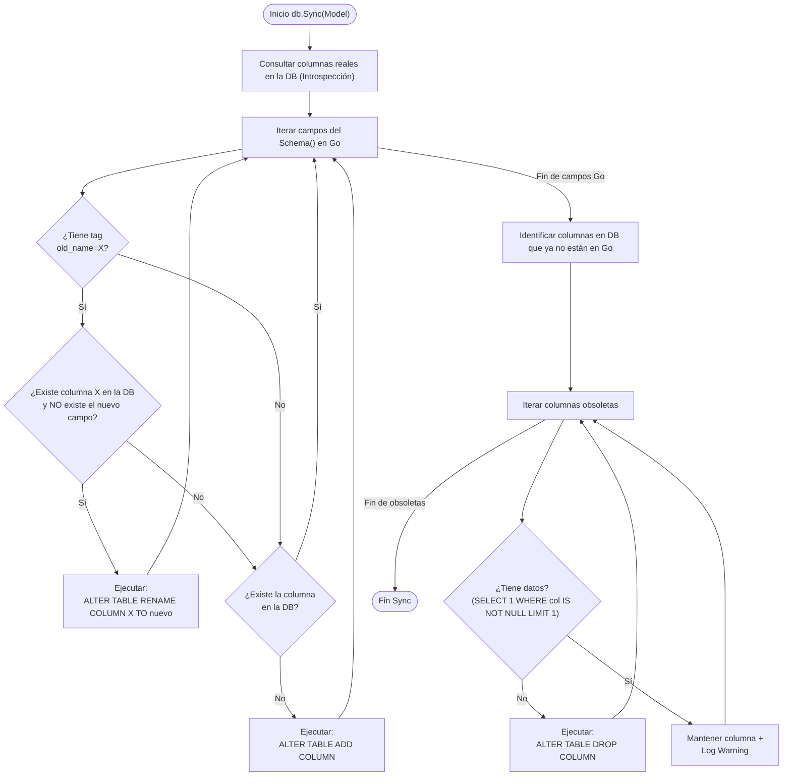

```mermaid
flowchart TD
    Start(["Inicio db.Sync(Model)"]) --> InspectDB["Consultar columnas reales en la DB (Introspección)"]
    InspectDB --> LoopFields["Iterar campos del Schema() en Go"]

    %% --- Proceso de Campos en Go ---
    LoopFields --> HasRenameTag{"¿Tiene tag<br/>old_name=X?"}
    HasRenameTag -- Sí --> CheckOldCol{"¿Existe columna X en la DB<br/>y NO existe el nuevo campo?"}
    CheckOldCol -- Sí --> ExecRename["Ejecutar:<br/>ALTER TABLE RENAME COLUMN X TO nuevo"] --> LoopFields
    CheckOldCol -- No --> AddOrSkip
    HasRenameTag -- No --> AddOrSkip{"¿Existe la columna<br/>en la DB?"}
    
    AddOrSkip -- No --> ExecAdd["Ejecutar:<br/>ALTER TABLE ADD COLUMN"] --> LoopFields
    AddOrSkip -- Sí --> LoopFields

    %% --- Proceso de Columnas Obsoletas (Borrados) ---
    LoopFields -- "Fin de campos Go" --> FindObsoletes["Identificar columnas en DB que ya no están en Go"]
    FindObsoletes --> LoopObsoletes["Iterar columnas obsoletas"]
    
    LoopObsoletes --> CheckData{"¿Tiene datos?<br/>(SELECT 1 WHERE col IS NOT NULL LIMIT 1)"}
    CheckData -- No --> ExecDrop["Ejecutar:<br/>ALTER TABLE DROP COLUMN"] --> LoopObsoletes
    CheckData -- Sí --> KeepAndWarn["Mantener columna +<br/>Log Warning"] --> LoopObsoletes
    
    LoopObsoletes -- "Fin de obsoletas" --> End(["Fin Sync"])
```
