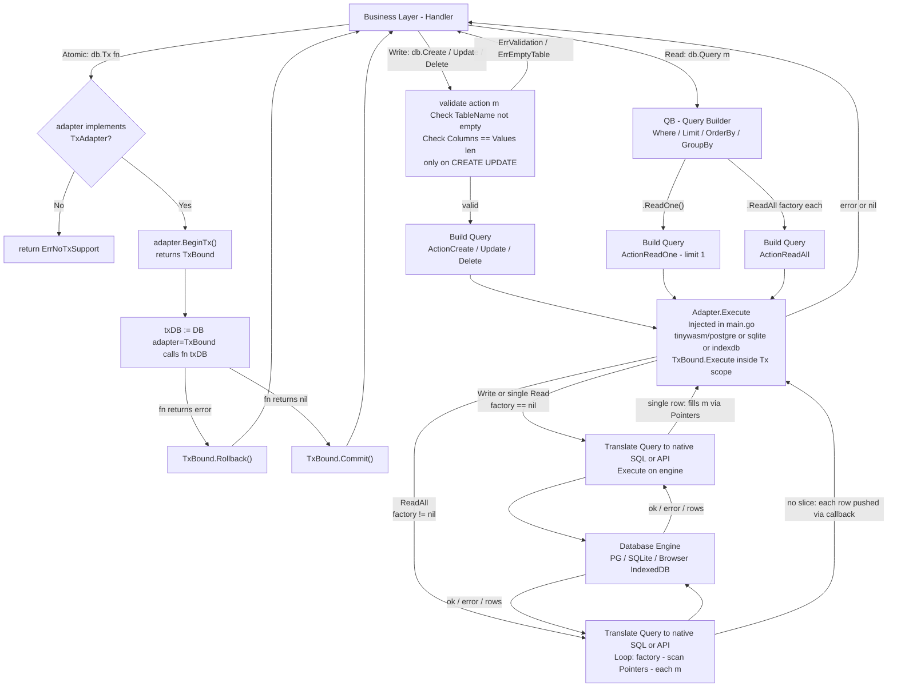

```mermaid
flowchart TD
    %% 1. User Application Layer
    Handler["Business Layer - Handler"]

    Handler -- Write: db.Create / Update / Delete --> Validate
    Handler -- Read: db.Query m --> QB
    Handler -- Atomic: db.Tx fn --> TxCheck

    %% 2. Transaction Path
    TxCheck{"adapter implements<br/>TxAdapter?"}
    TxCheck -- No --> ErrNoTx["return ErrNoTxSupport"]
    TxCheck -- Yes --> BeginTx["adapter.BeginTx()<br/>returns TxBound"]
    BeginTx --> TxDB["txDB := DB adapter=TxBound <br/>calls fn txDB"]
    TxDB -- fn returns error --> Rollback["TxBound.Rollback()"]
    TxDB -- fn returns nil --> Commit["TxBound.Commit()"]
    Rollback --> Handler
    Commit --> Handler

    %% 3. Query Builder Path
    QB["QB - Query Builder<br/>Where / Limit / OrderBy / GroupBy"]
    QB -- .ReadOne() --> BuildRead
    QB -- .ReadAll factory each --> BuildReadMany

    BuildRead["Build Query<br/>ActionReadOne - limit 1"]
    BuildReadMany["Build Query<br/>ActionReadAll"]

    %% 4. Write Path
    Validate["validate action m <br/>Check TableName not empty<br/>Check Columns == Values len<br/>only on CREATE UPDATE"]
    Validate -- valid --> BuildWrite
    Validate -- ErrValidation / ErrEmptyTable --> Handler

    BuildWrite["Build Query<br/>ActionCreate / Update / Delete"]

    %% 5. Adapter Dispatch
    BuildWrite --> Adapter
    BuildRead --> Adapter
    BuildReadMany --> Adapter

    Adapter["Adapter.Execute<br/>Injected in main.go<br/>tinywasm/postgre or sqlite or indexdb<br/>TxBound.Execute inside Tx scope"]

    %% 6. Adapter internal routing
    Adapter -- Write or single Read<br/>factory == nil --> ExecSingle
    Adapter -- ReadAll<br/>factory != nil --> ExecMany

    ExecSingle["Translate Query to native SQL or API<br/>Execute on engine"]
    ExecMany["Translate Query to native SQL or API<br/>Loop: factory - scan Pointers - each m"]

    %% 7. Engine
    ExecSingle --> Engine["Database Engine<br/>PG / SQLite / Browser IndexedDB"]
    ExecMany --> Engine

    Engine -- ok / error / rows --> ExecSingle
    Engine -- ok / error / rows --> ExecMany

    %% 8. Results
    ExecSingle -- single row: fills m via Pointers --> Adapter
    ExecMany -- no slice: each row pushed via callback --> Adapter

    Adapter -- error or nil --> Handler
```
