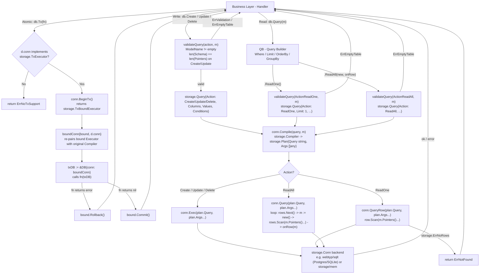

```mermaid
flowchart TD
    %% 1. User Application Layer
    Handler["Business Layer - Handler"]

    Handler -- "Write: db.Create / Update / Delete" --> Validate
    Handler -- "Read: db.Query(m)" --> QB
    Handler -- "Atomic: db.Tx(fn)" --> TxCheck

    %% 2. Transaction Path
    TxCheck{"d.conn implements<br/>storage.TxExecutor?"}
    TxCheck -- No --> ErrNoTx["return ErrNoTxSupport"]
    TxCheck -- Yes --> BeginTx["conn.BeginTx()<br/>returns storage.TxBoundExecutor"]
    BeginTx --> BoundConn["boundConn{bound, d.conn}<br/>re-pairs bound Executor with original Compiler"]
    BoundConn --> TxDB["txDB := &DB{conn: boundConn}<br/>calls fn(txDB)"]
    TxDB -- fn returns error --> Rollback["bound.Rollback()"]
    TxDB -- fn returns nil --> Commit["bound.Commit()"]
    Rollback --> Handler
    Commit --> Handler

    %% 3. Query Builder Path
    QB["QB - Query Builder<br/>Where / Limit / OrderBy / GroupBy"]
    QB -- ".ReadOne()" --> BuildRead
    QB -- ".ReadAll(new, onRow)" --> BuildReadMany

    BuildRead["validateQuery(ActionReadOne, m)<br/>storage.Query{Action: ReadOne, Limit: 1, ...}"]
    BuildReadMany["validateQuery(ActionReadAll, m)<br/>storage.Query{Action: ReadAll, ...}"]
    BuildRead -- ErrEmptyTable --> Handler
    BuildReadMany -- ErrEmptyTable --> Handler

    %% 4. Write Path
    Validate["validateQuery(action, m)<br/>ModelName != empty<br/>len(Schema) == len(Pointers) on Create/Update"]
    Validate -- valid --> BuildWrite
    Validate -- "ErrValidation / ErrEmptyTable" --> Handler

    BuildWrite["storage.Query{Action: Create/Update/Delete, Columns, Values, Conditions}"]

    %% 5. Compile: agnostic Query -> engine-specific Plan
    BuildWrite --> Compile
    BuildRead --> Compile
    BuildReadMany --> Compile

    Compile["conn.Compile(query, m)<br/>storage.Compiler -> storage.Plan{Query string, Args []any}"]

    %% 6. Execute against the backend's storage.Conn
    Compile --> Dispatch{"Action?"}
    Dispatch -- "Create / Update / Delete" --> Exec["conn.Exec(plan.Query, plan.Args...)"]
    Dispatch -- ReadOne --> QueryRow["conn.QueryRow(plan.Query, plan.Args...)<br/>row.Scan(m.Pointers()...)"]
    Dispatch -- ReadAll --> QueryMany["conn.Query(plan.Query, plan.Args...)<br/>loop: rows.Next() -> m := new() -> rows.Scan(m.Pointers()...) -> onRow(m)"]

    %% 7. Backend (any storage.Conn implementation)
    Exec --> Engine["storage.Conn backend<br/>e.g. webtyp/sqlt (Postgres/SQLite) or storage/mem"]
    QueryRow --> Engine
    QueryMany --> Engine

    QueryRow -- "storage.ErrNoRows" --> NotFound["return ErrNotFound"]
    NotFound --> Handler
    Engine -- "ok / error" --> Handler
```
